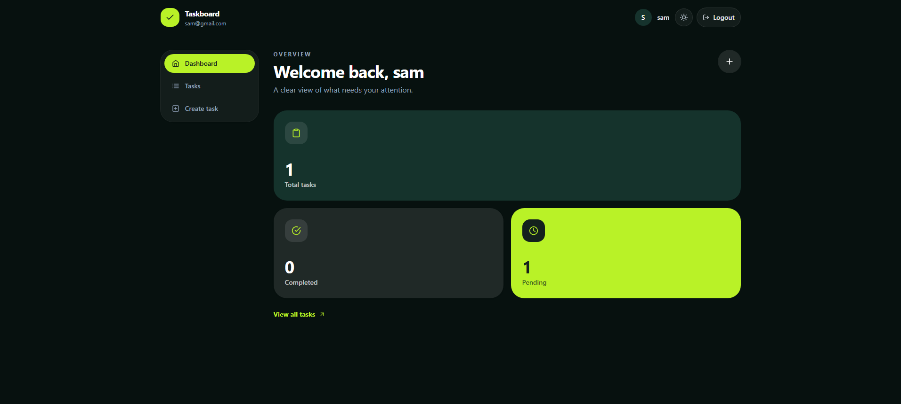
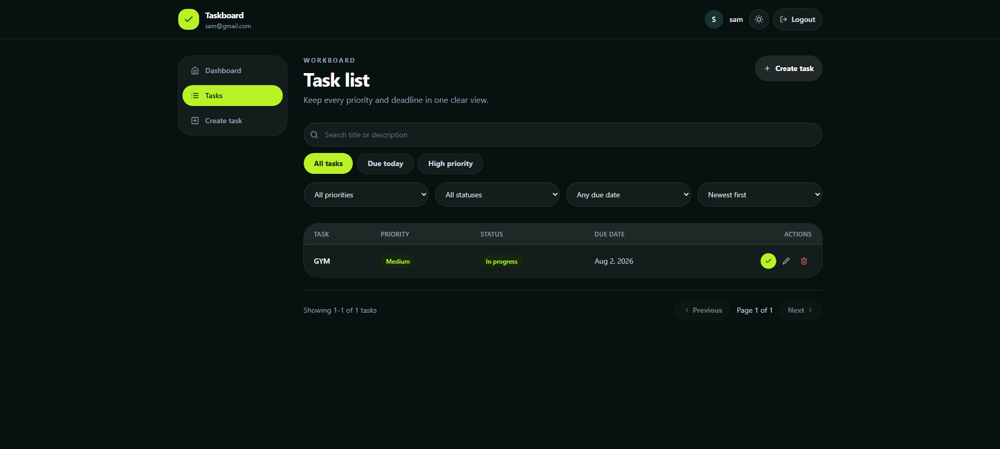
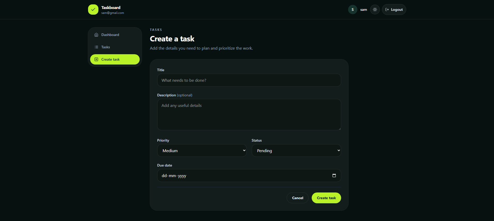
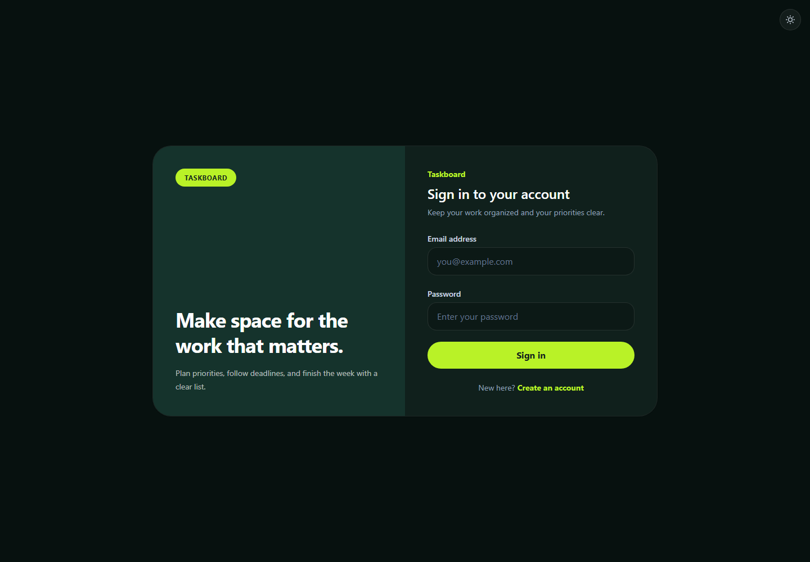
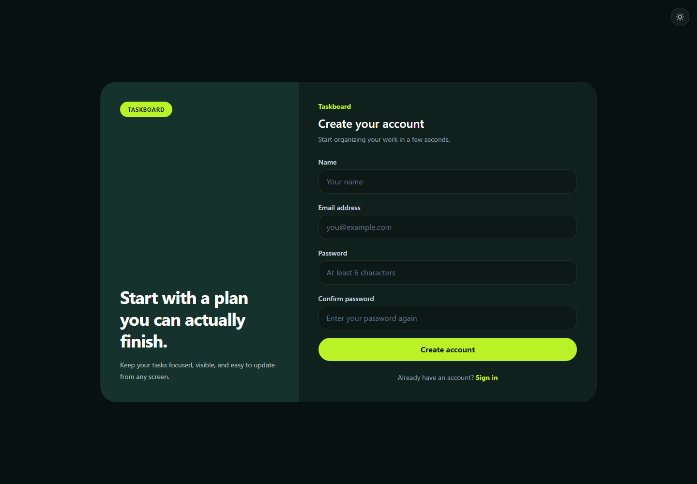

# Task Management System

## Project overview

A small full-stack task manager built as a weekend assignment. Users can create an account, manage their own tasks, track dashboard totals, and search or filter their workload.

## Features

- JWT authentication using HTTP-only cookies
- Register, login, logout, and session restoration
- User-scoped task CRUD and mark-complete action
- Dashboard totals for completed and outstanding work
- Search across task titles and descriptions
- Priority, status, and due-date filters
- Configurable sorting and server-side pagination
- Responsive card and table layouts
- Persistent light and dark themes
- Central API errors and request validation

## Screenshots

### Dashboard



### Task list



### Create task



### Authentication

| Login | Registration |
| --- | --- |
|  |  |

## Stack

**Backend:** Node.js, Express, MongoDB, Mongoose, JWT, bcrypt, express-validator

**Frontend:** React, React Router, Axios, Tailwind CSS, React Hook Form, React Hot Toast

## Project structure

```text
backend/
  src/
    config/       Database and environment configuration
    controllers/  HTTP request and response handling
    middleware/   Authentication, validation, and errors
    models/       Mongoose schemas
    routes/       Express route definitions
    services/     Authentication and task business logic
    utils/        Tokens, errors, and pagination
    validators/   express-validator rules

frontend/
  src/
    components/   Shared navigation, forms, and task views
    context/      Authentication state
    hooks/        Authentication hook
    pages/        Route-level screens
    services/     Axios configuration
    utils/        Display constants and formatting
```

## Database schema

### User

| Field | Type | Notes |
| --- | --- | --- |
| `name` | String | Required, maximum 60 characters |
| `email` | String | Required, unique and normalized |
| `password` | String | Required, bcrypt hash excluded from normal queries |
| `createdAt`, `updatedAt` | Date | Managed by Mongoose timestamps |

### Task

| Field | Type | Notes |
| --- | --- | --- |
| `user` | ObjectId | Required reference to the task owner |
| `title` | String | Required, maximum 120 characters |
| `description` | String | Optional, maximum 1,000 characters |
| `priority` | String | `low`, `medium`, or `high` |
| `status` | String | `pending`, `in-progress`, or `completed` |
| `dueDate` | Date | Required |
| `createdAt`, `updatedAt` | Date | Managed by Mongoose timestamps |

## Requirements

- Node.js 22.12 or newer
- npm
- MongoDB running locally or a MongoDB Atlas connection string

## Environment variables

| Variable | Application | Purpose |
| --- | --- | --- |
| `MONGODB_URI` | Backend | MongoDB connection string |
| `JWT_SECRET` | Backend | Secret used to sign authentication tokens |
| `JWT_EXPIRES_IN` | Backend | Token lifetime, such as `7d` |
| `COOKIE_EXPIRES_IN_DAYS` | Backend | Authentication cookie lifetime |
| `CLIENT_URL` | Backend | Frontend origin for CORS during local development |
| `NODE_ENV` | Backend | Runtime environment |
| `VITE_API_URL` | Frontend | Base URL for API requests |

## Setup instructions

### 1. Backend

```bash
cd backend
npm install
```

Copy `backend/.env.example` to `backend/.env`, then update the values if needed:

```env
PORT=5000
MONGODB_URI=mongodb://127.0.0.1:27017/task_management
JWT_SECRET=use-a-long-random-development-secret
JWT_EXPIRES_IN=7d
COOKIE_EXPIRES_IN_DAYS=7
CLIENT_URL=http://localhost:5173
NODE_ENV=development
```

Start the API:

```bash
npm run dev
```

The health endpoint is available at `http://localhost:5000/api/health`.

### 2. Frontend

Open a second terminal:

```bash
cd frontend
npm install
```

Copy `frontend/.env.example` to `frontend/.env`:

```env
VITE_API_URL=http://localhost:5000/api
```

Start the client:

```bash
npm run dev
```

Open `http://localhost:5173`.

## API documentation

All task routes require the JWT cookie created during registration or login.

| Method | Endpoint | Description |
| --- | --- | --- |
| GET | `/api/health` | Health check |
| POST | `/api/auth/register` | Create an account |
| POST | `/api/auth/login` | Log in |
| GET | `/api/auth/me` | Get the current user |
| POST | `/api/auth/logout` | Clear the session |
| POST | `/api/tasks` | Create a task |
| GET | `/api/tasks` | List tasks |
| GET | `/api/tasks/stats` | Get dashboard totals |
| GET | `/api/tasks/:taskId` | Get one task |
| PUT | `/api/tasks/:taskId` | Update a task |
| PATCH | `/api/tasks/:taskId/status` | Update a task status |
| DELETE | `/api/tasks/:taskId` | Delete a task |

The list endpoint accepts `search`, `priority`, `status`, `dueDate`, `sort`, `page`, and `limit`. See the included Postman collection for examples.

## Postman

Import `postman/Task-Management.postman_collection.json` into Postman. The collection uses `http://localhost:5000/api` by default and keeps the authentication cookie automatically.

Run Register first, then Create Task. The create request stores the returned task ID in the collection variable used by the read, update, complete, and delete requests.

## Deployment

The application deploys as one Render web service. Render builds the React client, starts the Express API, and Express serves the generated frontend from the same origin.

### Database

1. Create a MongoDB Atlas cluster and database user.
2. Add the appropriate network access rule.
3. Copy the Atlas connection string for `MONGODB_URI`.

### Full application on Render

1. Push the repository to GitHub.
2. Create a Render Blueprint from the root `render.yaml`.
3. Enter `MONGODB_URI` when prompted.
4. Wait for the frontend build and backend startup to complete.
5. Open the generated `onrender.com` URL.
6. Confirm `/api/health` returns a successful response.

`JWT_SECRET` is generated by Render and is not stored in source control.

The deployed frontend calls `/api` on the same Render domain, so no production CORS or cross-site cookie configuration is required.

## Useful commands

```bash
# Backend development
cd backend && npm run dev

# Backend production start
cd backend && npm start

# Frontend development
cd frontend && npm run dev

# Frontend production build
cd frontend && npm run build
```
